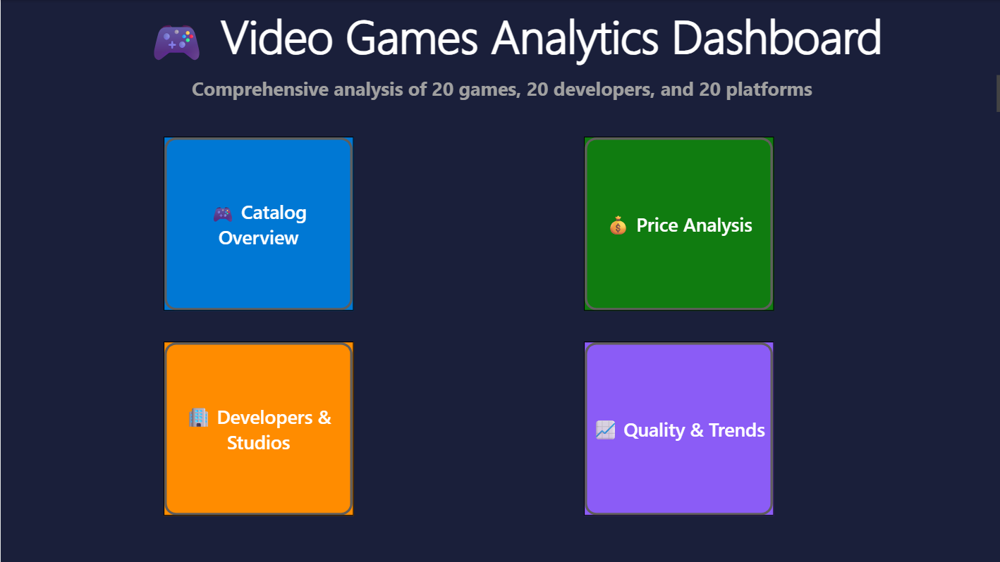

# Power BI Dashboard — Video Games Analysis

## Overview
Interactive Power BI dashboard analyzing a video games catalog. 
The dashboard consolidates data from multiple sources and provides 
5 dedicated pages with KPIs, trends, and drill-down capabilities to 
help understand the gaming market.

## Objectives
- Consolidate and model video games data in Power BI
- Build interactive KPI dashboards across 5 thematic pages
- Enable filtering and drill-down by genre, platform, developer, and year
- Communicate insights visually for non-technical stakeholders

## Tools & Technologies
- Microsoft Power BI Desktop
- Power Query — data transformation
- DAX — calculated measures and KPIs
- Data Modeling — relationships between tables

## Dashboard Pages

### 1. Home
Landing page with navigation and high-level summary.

### 2. Catalog Overview
Global view of the games catalog with KPIs and breakdowns.

### 3. Developers Analysis
Performance analysis by development studios.

### 4. Price Analysis
Pricing trends across platforms, genres, and years.

### 5. Quality & Trends
Game quality (Metascore) analysis and time-based trends.

## Files
- `dashboard.pbix` — Power BI report file
- `HOME.png` — home page screenshot
- `Catalog Overview.png` — catalog overview page
- `Developers Analysis.png` — developers analysis page
- `Price Analysis.png` — price analysis page
- `Quality & Trends.png` — quality and trends page

## How to View
**Option 1 (recommended):** View the screenshots above for a full preview — no installation needed.

**Option 2 (full interactivity):**
1. Download [Power BI Desktop](https://powerbi.microsoft.com/desktop/) (free)
2. Open `dashboard.pbix`
3. Interact with the filters and slicers

## Author
Yoni Allouche — [allouny98@gmail.com](mailto:allouny98@gmail.com)
